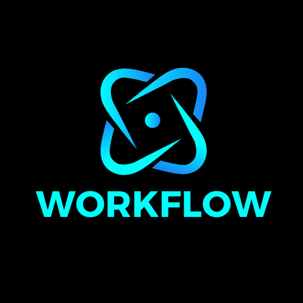

## Workflow is a Golang workflow framework that encompasses these main features:
- Defining small units of work called "Steps"
- Consumer management and graceful shutdown
- Supports event streaming platforms such as Kafka and Reflex (or you can write your own implementation of the EventStreamer interface!)
- Built in support for timeout operations (e.g. account cool down periods etc).
- Built in support for callbacks (e.g. Call an async endpoint and trigger the callback from a webhook handler).
- Connect two workflows together. Wait for specific events from another workflow and make it part of your workflow!
- Super Duper testable

## Example

Head on over to ./examples to get familiar with the syntax 😊

## Testing

One core focus of `workflow` is to encourage writing tests by making it easy to do so.

The `testing.go` file houses utility functions for testing your workflow. Some other
 useful patterns is to use `k8s.io/utils/clock/testing` testing clock to manipulate
 time and ensure your functions are executing at the exact time and date that they should.

`Require`: Allows for placing assertions or requirements on the state at a specific point in the workflow.

`TriggerCallbackOn`: Allows you to easily simulate a callback when the workflow is at a specific
point in its flow.

`AwaitTimeoutInsert`: AwaitTimoutInsert helps wait for the timout to be created after which you can use the clock
 to change the time to speed up / skip the timeout process

## Authors

- [@andrewwormald](https://github.com/andrewwormald)
